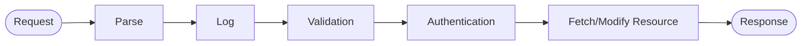
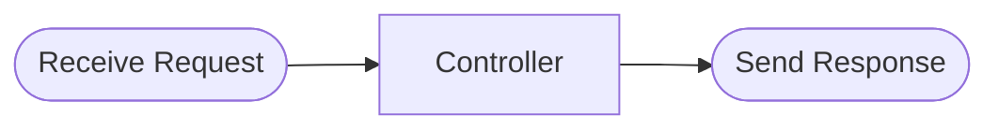
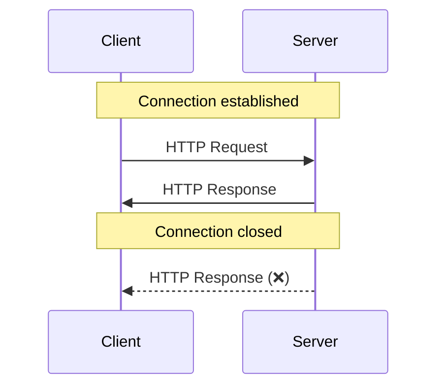
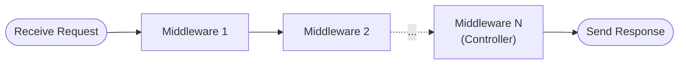

# NodeJS 백엔드

## 개발 계획

- 회원가입, 로그인 (이메일 + 비밀번호)
- 게시글 열람, 작성, 수정, 삭제

## 개발 환경설정

```bash
npm init -y (-y: 모든 입력값을 기본값으로 설정)
npm install express
npm install -D @types/express
npm install -D typescript
npm install -D prettier
npm install -D nodemon
npm install -D ts-node
npm install env
```

`package.json`

```json
{
  "main": "src/index.js",
  "scripts": {
    "build": "tsc -p .",
    "start": "node dist/index.js",
    "dev": "nodemon --watch \"src/**/*.ts\" --exec \"ts-node\" src/index.ts"
  }
}
```

> 나머지 값은 기본값 유지

### TypeScript

```bash
npx tsc --init
```

`tsconfig.json`

```json
{
  "compilerOptions": {
    "target": "es2016",
    "experimentalDecorators": true,
    "emitDecoratorMetadata": true,
    "module": "commonjs",
    "typeRoots": ["./src/types"],
    "outDir": "./dist",
    "esModuleInterop": true,
    "forceConsistentCasingInFileNames": true,
    "strict": true,
    "noImplicitAny": true,
    "skipLibCheck": true
  },
  "ts-node": {
    "files": true
  }
}
```

### Prettier

`.prettierrc`

```javascript
{
  "semi": true,
  "tabWidth": 2,
  "arrowParens": "always"
}
```

### gitignore

```bash
wget -O ".gitignore" https://www.toptal.com/developers/gitignore/api/macos,node
```

### 폴더 생성

```
src/
├── controllers/
├── models/
├── middlewares/
├── services/
└── index.ts
```

### 환경 변수

`.env`

```bash
NODE_ENV="development"
JWT_SECRET=
DB_HOST=localhost
DB_PORT=3306
DB_USERNAME=
DB_PASSWORD=
DB_DATABASE=
```

#### Secret 생성 (UNIX)

```bash
openssl rand -base64 64
```

## Overview



- [ ] Parse request
- [ ] Log request
- [ ] Validation
- [ ] Authentication
- [ ] Fetch/Modify Resources
- [ ] Send Response

## Express

### 컨트롤러

요청이 들어오면 실행해야 할 함수



- `app.use()`: All HTTP methods
- 컨트롤러 실행순서
  - 먼저 등록된 컨트롤러가 우선 매칭됨
- `app.get()`, `app.post()`, `app.put()`, `app.patch()`, `app.delete()`: Specific HTTP Method

### `Response` Object

HTTP 응답을 보내는 API를 포함한 객체

- `res.status(200)`
- `res.send()`
- `res.json()`
- Response는 **딱 한번만** 보낼 수 있음



### `Request` Object

들어온 요청에 관련된 정보가 담겨 있는 객체

- `req.query`
- `req.params`
- `req.body`

```HTTP
POST /account HTTP/1.1
Host: localhost
Accept: application/json
Accept-Encoding: gzip, deflate
Connection: keep-alive

email=user%40gmail.com&password=securepw
```

### 미들웨어

요청이 들어오면 실행될 **모든** 함수**들**

- `express.json()`
- `express.urlencoded({ extended: true })`
- `express.static()`



### `NextFunction`

- `next()`: 다음 미들웨어 실행 (argument 없어야 함)
- `next(error)`: 에러 핸들러 실행 (추후 설명)

## Sequelize

### Connect

```typescript
import { Sequelize } from "sequelize-typescript";

const sequelize = new Sequelize({
  /// options
});
```

### Sync

- TS/JS 코드로 정의한 모델에 맞게 SQL DB 스키마를 생성 (말 그대로 동기화)

```typescript
await sequelize.sync({ force: true });
```

- `force: true`: DROP TABLE 실행 후 CREATE TABLE (데이터 초기화)
- `force: false`: ALTER TABLE (데이터 유지)

### Model 정의

```typescript
@Table({
  modelName: "User",
  tableName: "users",
  timestamps: true,
  underscored: true,
  charset: "utf8mb4",
  collate: "utf8mb4_general_ci",
})
class User extends Model<ModelAttribs, ModelCAttribs> {
  @AllowNull(false)
  @Unique("users.username")
  @Column(DataType.STRING(36))
  username: string;
}
```

### Associations

- One-to-many
- One-to-One
- Many-to-many

### Query

- `SELECT`: `Model.findAll()`, `Model.findOne()`, `Model.findByPk()`
- `INSERT INTO`: `Model.create()`
- `UPDATE`: `model.set()`, `model.save()`
- `DELETE`: `Model.delete()`

## 환경변수

- `.env` 파일
- 암호, API 키 등

## JWT 인증

```bash
git cherry-pick 0b7ff0c
```

- HTTP `Authorization` Header or `httpOnly` Cookie
  - `Bearer <token_value>`
- `jwt.sign()`
- `jwt.verify()`

## 리팩토링

### `services/`

- 자주 사용하는 비즈니스 로직을 분리

### Express Router, `app.route()`

- 길고 복잡한 `path` 사용시 코드 정리

#### Before (`index.ts`)

```typescript
// 지저분한 index.ts
app.get("/post/:postId", viewPost);
app.post("/post/:postId", createPost);
app.put("/post/:postId", editPost);
app.patch("/post/:postId", editPost);
app.delete("/post/:postId", deletePost);
app.get("/post/:postId/likes", viewPostLikes);
app.get("/post/:postId/comments", viewPostComments);
app.post("/post/:postId/comments", createPostComment);
app.get("/post/:postId/tags", viewPostTags);
app.put("/post/:postId/tag/:tagId", editPostTag);
app.delete("/post/:postId/tag/:tagId", deletePostTag);
```

#### 정리 1: Router 사용

`routes/post.ts`

```typescript
// 라우터 사용하여 코드 분리
const postRouter = express.Router();
postRouter.get("/", viewPost);
postRouter.post("/", createPost);
// ...
postRouter.get("/tags", viewPostTags);
```

`index.ts`

```typescript
// 깨끗해진 index.ts
import postRouter from "routes/post";
app.route("/post/:postId", postRouter);
```

#### 정리 2: `app.route()` 사용

`routes/post.ts`

```typescript
postRouter.route("/tag/:tagId").get(viewPost).post(createPost);
```

### Error Handler

#### 문제 상황

- async 함수에서 throw 된 에러는 서버 전체를 터트림 (...)
- 에러 응답 보내는 코드 길고 귀찮음 & 코드 반복

#### 해결 방안

- `next(error)`: 모든 미들웨어/컨트롤러 건너뛰고 바로 에러 핸들러만 실행
- 항상 맨 마지막. 1개만.
- 컨트롤러에서 `try-catch` 문과 함께 사용시 코드 길이 단축 가능

```typescript
app.use((err: unknown, req: Request, res: Response, next: NextFunction) => {
  // 에러 대응 코드 작성 (예: 4XX, 5XX 응답 등)
});
```

> [Error Handling - ExpressJS 공식문서](https://expressjs.com/en/guide/error-handling.html)
